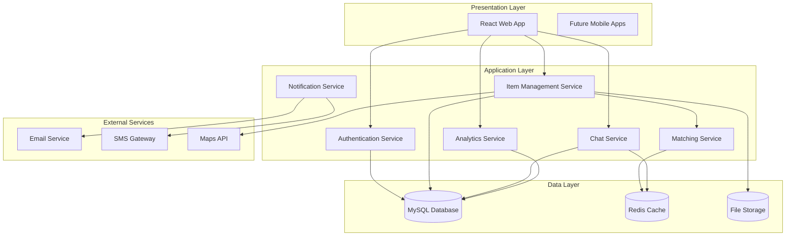

<h1 align="center">🔎 Campus Lost and Found Tracker</h1> 
     
 
 A centralized web-based platform that helps campus users report, search, and recover lost or found items efficiently through secure access, intelligent matching, and location-aware features. 

---

## 📌 Project Overview

Losing personal belongings on campus is a common issue faced by students, faculty, and staff, often leading to inconvenience and stress.  
The **Campus Lost and Found Tracker** provides a secure and organized digital solution that allows users to report, track, and match lost or found items in one centralized system.

By improving visibility and accessibility, the platform significantly increases the chances of quick item recovery and promotes a more connected campus environment.

---

## 🎯 Objectives

- Provide a centralized platform for reporting and viewing lost and found items  
- Enable quick and accurate matching between lost and found posts  
- Allow secure communication between users for item recovery  
- Ensure safety through verified campus-only access  
- Support admin moderation for reliability and authenticity  
- Analyze usage and recovery trends through dashboards and reports  

---

## 🛠️ Tech Stack

### Frontend
- **React.js** – Component-based UI for fast and interactive user experience  

### Backend
- **Spring Boot (Java)** – Secure REST APIs and backend logic  

### Database
- **MySQL** – Structured and reliable data storage  

### Tools
- **Postman** – API testing and validation  
- **Git & GitHub** – Version control  

---

## ⚙️ Core Features

- **Landing Page:** User-friendly entry point guiding login and registration  
- **Secure Authentication:** Campus-only verified access  
- **Lost & Found Posting:** Submit items with images, categories, and tags  
- **Matching Algorithm:** Keyword and location-based matching  
- **Hotspot Feature:** Identifies frequent loss locations  
- **In-App Chat:** Secure communication between users  
- **Admin Moderation:** Approval and content validation  
- **Analytics Dashboard:** Usage and recovery insights  

---

## 🔄 Application Workflow

1. **🖥️ Login / Registration** – Access via verified campus credentials  
2. **📌 Item Posting** – Submit lost or found items with details and images  
3. **🧠 Matching Engine** – System suggests potential matches and hotspots  
4. **💬 Secure Chat** – Users communicate to arrange recovery  
5. **📊 Admin Oversight** – Moderation and analytics monitoring  

---

## 🏗️ System Architecture

## 🖼️ Insights

### Landing Page

### Login and Registration

   

### Dashboard

### Lost and Found Item Posting

### Matching Algorithm

### In-App Chat

## 👥 Team Details

**Team 3**
- Mathew Charles  
- Dharshini Siva  
- Surtilochan Dash  
- Harini R  

**In-charge Trainer:** Ms. Pavithra Kannan

## 🚀 Future Enhancements
- **Campus Map Integration:** Visual representation of lost and found hotspots across the campus.  
- **Multi-Platform App:** Extend the platform to mobile and other devices for wider accessibility.  
- **Push Notifications:** Instant alerts when a lost or found item matches a user’s report.  
- **AI-Based Matching:** Use image recognition and intelligent algorithms for faster and more accurate matches.    
- **Enhanced Security & Privacy:** Advanced authentication and reporting features for safer user experience.
  

## 👥 Contributing
We welcome contributions! Here's how you can help
Ways to Contribute
- **Report Bugs** Create issues with detailed descriptions
- **Suggest Features**  Share your ideas for improvement
- **Submit Code**  Fix bugs or add features via PRs
### Development Process
bash
- **Fork the repository**
- **Clone your fork** git clone  https://github.com/MattCharles10/Campus_Lost_and_found.git
- **Create feature branch**   git checkout -b feature/amazing-feature
- **Make changes and commit** git commit -m "Add amazing feature"
- **Push to your fork** git push origin mathew/amazing-feature
- **Create Pull Request**
  
## 📄 License
This project is licensed under the MIT License - see the LICENSE file for details. 

## ✅ Conclusion
The **Campus Lost and Found Tracker** provides a reliable, secure, and location-aware solution for managing lost and found items within a campus. By combining an intuitive user interface, intelligent matching, hotspot analysis, and secure communication, the platform enhances recovery efficiency and strengthens collaboration among campus users.

 Made with ❤️ for campus communities worldwide 

 <strong>⭐ Star this repository if you find it useful!</strong> 

 <a href="#-campus-lost-and-found-tracker">Back to Top ↑</a> 

